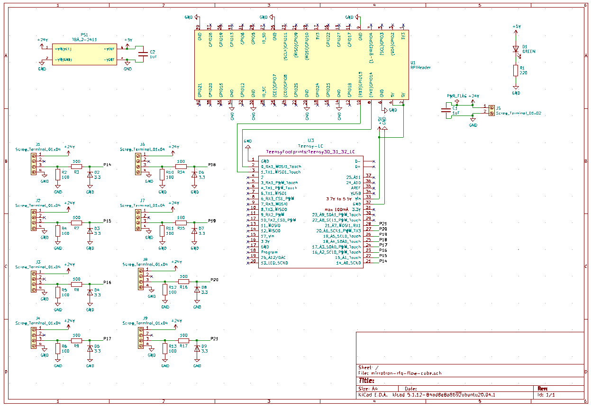
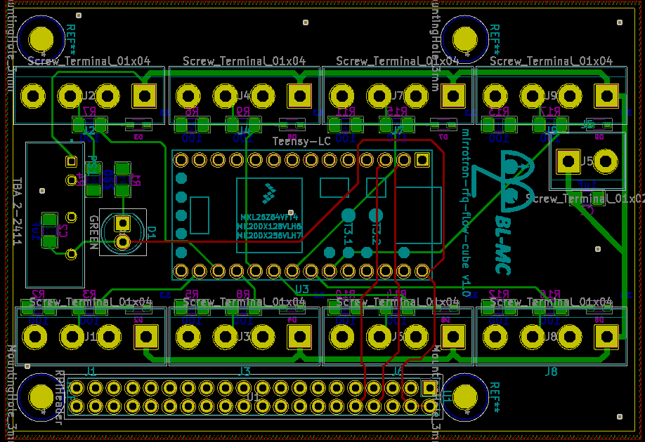

# RFQ Flow Cube
* <a href="https://github.com/bl-mirrotron/mirrotron-rfq-flow-cube" target="_blank">Source code</a>
* [Cooling system overview](https://bl-mirrotron.github.io/#cooling-system)
* [Control system overview](https://bl-mirrotron.github.io/)

The function of the RFQ Flow Cube is to measure the water flow rate of the cooling channels on both the upstream and downstream headers. The flows  are measured with ultrasonic clamp-on Keyence <a href="https://www.keyence.com/products/process/flow/fd-q/models/fd-q20c/." target="_blank">FD-Q20C.</a> sensors. Each FD-Q20C requires 24V, 0.1A to power, The simplest way to read the sensor is to use the 4-20mA loop provided by the sensor. The sensor type and internal limits are set locally.

The sensors are connected to terminal blocks as shown in the schematic for the electrical circuit in Figure 1. Each terminal block supplies 24V provided from an single external supply to a sensor. The sensor provides a current that is proportional to the flow rate to a 100 Ohm resistor on the circuit board. The voltage drop across the 100 Ohm resistor is digitized by 10 bit digitizers on a <a href="https://www.pjrc.com/teensy/teensyLC.html" target="_blank">Teensy-LC</a> as the micro-controller. The Teensy-LC communicates to a Blinky-LiteTM tray via the <a href="https://github.com/bl-mirrotron/mirrotron-rfq-flow-cube/blob/master/cubeCode/BlinkyBus.h" target="_blank">Blinky-Bus protocol</a> over the Serial1 port. The cube sends over raw digitized values which are to be appropriately scaled in the Blinky-LiteTM tray.

The board is designed to handle up to eight probes. The PCB layout for the electrical circuit is shown in Figure 2. There is a 2x20 pin header mounted on the back of the PCB so that the cube can be directly mounted to a Raspberry Pi header for power and communications. 5V power to the Teensy-LC is provided through the header from Raspberry Pi. A manufactured board is shown in Figure 3.

Figure 1.  Electrical Schematic for rfq-flow-cube board

 

Figure 2.  PCB layout for rfq-flow-cube board

 

Figure 3.  rfq-flow-cube

 
